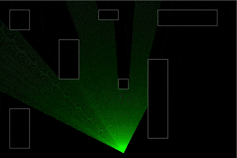

# Ray casting 2d using go + ebiten



1. Install dependencies

```
$ go get -d ./...
```

2. build the application

```
$ go build .\cmd\game\
```

3. Run the executable

```
$ ./game.exe
```

Alternatively you can just run it without building (skip step 2 and 3)

```
$ go run ./cmd/game
```
